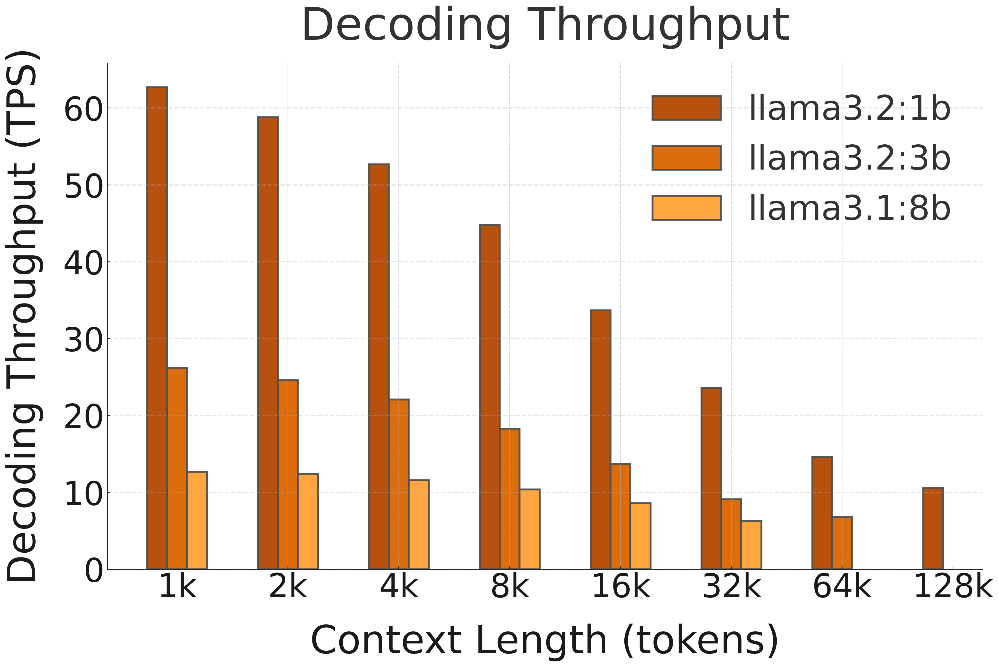

## ⚡ Performance and Efficiency Benchmarks

This section reports the performance of LLaMA 3.x on NPU with FastFlowLM (FLM).

> **Note:** 
- Results are based on FastFlowLM v0.9.21.  
- Under FLM's default NPU power mode (Performance)   
- Test system spec: AMD Ryzen™ AI 7 350 (Krakan Point) with 32 GB DRAM.   
- Newer versions may deliver improved performance.   

  
  

---

### 🚀 Decoding Speed (TPS, or Tokens per Second, starting @ different context lengths)

| **Model**        | **Hardware** | **1k** | **2k** | **4k** | **8k** | **16k** | **32k** | **64k** | **128k** | **Model**        |
|------------------|--------------|-------:|-------:|-------:|-------:|--------:|--------:|--------:|---------:|------------------|
| **LLaMA 3.2 1B** | NPU (FLM)    |62.7	| 58.8	| 52.7	| 44.8	| 33.7	| 23.6	| 14.6	  | 10.6    | **LLaMA 3.2 1B** |
| **LLaMA 3.2 3B** | NPU (FLM)    | 26.2 | 24.6	| 22.1	| 18.3	| 13.7	| 9.1	| 6.8     | OOM      | **LLaMA 3.2 3B** |
| **LLaMA 3.1 8B** | NPU (FLM)    | 12.7 | 12.4	| 11.6	| 10.4	| 8.6	| 6.3   | OOM     | OOM      | **LLaMA 3.1 8B** |

<!-- | **Model**        | **Hardware** | **1k** | **2k** | **4k** | **8k** | **16k** | **32k** | **64k** | **128k** | **Hardware** | **Model**        |
|------------------|--------------|-------:|-------:|-------:|-------:|--------:|--------:|--------:|---------:|--------------|------------------|
| **LLaMA 3.2 1B** | NPU (FLM)    | 41.5   | 40.6   | 38.1   | 33.2   | 25.6    | 18.6    | 12.2    | 8.9      | NPU (FLM)    | **LLaMA 3.2 1B** |
|                  | NPU (RAI)    | 18.6   | 14.9   | *NA*   | *NA*   | *NA*    | *NA*    | *NA*    | *NA*     | NPU (RAI)    |                  |
|                  | iGPU         | 28.7   | 19.0   | 10.9   | 6.0    | 3.2     | 1.6     | 0.8     | OOM      | iGPU         |                  |
|                  | CPU          | 54.6   | 52.6   | 42.3   | 34.1   | 24.4    | 14.8    | 8.4     | OOM      | CPU          |                  |

| **Model**        | **Hardware** | **1k** | **2k** | **4k** | **8k** | **16k** | **32k** | **64k** | **128k** | **Hardware** | **Model**        |
|------------------|--------------|-------:|-------:|-------:|-------:|--------:|--------:|--------:|---------:|--------------|------------------|
| **LLaMA 3.2 3B** | NPU (FLM)    | 18.3   | 17.8   | 15.9   | 13.6   | 10.5    | 7.3     | 6.3     | OOM      | NPU (FLM)    | **LLaMA 3.2 3B** |
|                  | NPU (RAI)    | 9.0    | 6.1    | *NA*   | *NA*   | *NA*    | *NA*    | *NA*    | *NA*     | NPU (RAI)    |                  |
|                  | iGPU         | 23.2   | 18.8   | 14.0   | 9.2    | 5.5     | 3.0     | OOM     | OOM      | iGPU         |                  |
|                  | CPU          | 22.6   | 21.3   | 17.5   | 14.1   | 9.4     | 6.1     | OOM     | OOM      | CPU          |                  |

| **Model**        | **Hardware** | **1k** | **2k** | **4k** | **8k** | **16k** | **32k** | **64k** | **128k** | **Hardware** | **Model**        |
|------------------|--------------|-------:|-------:|-------:|-------:|--------:|--------:|--------:|---------:|--------------|------------------|
| **LLaMA 3.1 8B** | NPU (FLM)    | 9.1    | 9.0    | 8.3    | 7.5    | 6.2     | 4.6     | OOM     | OOM      | NPU (FLM)    | **LLaMA 3.1 8B** |
|                  | NPU (RAI)    | 6.3    | 4.6    | *NA*   | *NA*   | *NA*    | *NA*    | *NA*    | *NA*     | NPU (RAI)    |                  |
|                  | iGPU         | 11.3   | 9.9    | 7.7    | 5.4    | 3.4     | OOM     | OOM     | OOM      | iGPU         |                  |
|                  | CPU          | 10.3   | 7.7    | 7.6    | 6.7    | 5.8     | OOM     | OOM     | OOM      | CPU          |                  | -->
<!-- > **Note:** 
- The official release of Ryzen™ AI Software limits context length to 2,048 tokens, thus "*NA*" is used in the table (NPU-only mode). 
- The hybrid mode of Ryzen™ AI Software uses iGPU for decoding. Its performance is simliar to iGPU (LM Studio). Also, it limits context length to 2,048, thus, we did not include hybrid mode for comparison.  -->
> OOM: Out Of Memory  
> Only <50% system DRAM can be accessed by NPU  
> On systems with more than 32 GB DRAM, longer context lengths are supported. FLM supports the full context length available for each model.  

---
<!-- 
### 🔋 Average Power Consumption (Watts) during decoding

| **Method**         | **CPU** | **NPU** | **iGPU** | **Total Power (W)** | **Efficiency Gain** |
|--------------------|--------:|--------:|--------:|---------------------:|----------------------:|
| NPU (FLM)          | 0.5     | 1.6      | 0         | **2.1**           | –                 |
| NPU (RAI)          | 11    | 2.0       | 0          | 13                 | 6.1×                |
| iGPU               | 11.3    | 0       | 9.00       | 20.3               | 9.7×               |
| CPU                | 18      | 0       | 0          | 18.0               | 8.6×             |

--- -->

### 🚀 Prefill Speed (TPS, or Tokens per Second, with different prompt lengths)

| **Model**        | **Hardware**       | **1k** | **2k** | **4k** | **8k** | **16k** | **32k** |**Model**        |
|------------------|--------------------|--------:|--------:|--------:|--------:|---------:|---------:|---------|
| **LLaMA 3.2 1B** | NPU (FLM)    |1442	|1766|	1750|	1473|	967|	577|**LLaMA 3.2 1B** |
| **LLaMA 3.2 3B**  | NPU (FLM)    | 678|	797|	738|	583|	373|	214|**LLaMA 3.2 3B**  |
| **LLaMA 3.1 8B**   | NPU (FLM)    | 384|	447|	426|	376|	267|	167|**LLaMA 3.1 8B**   |