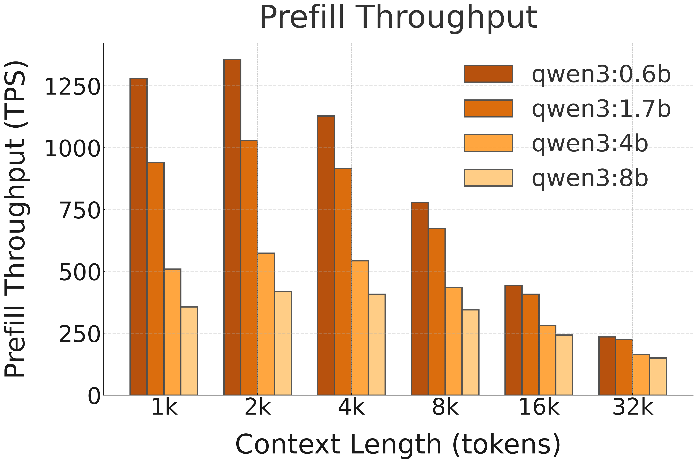

## ⚡ Performance and Efficiency Benchmarks

This section reports the performance of Qwen 3 on NPU with FastFlowLM (FLM).

> **Note:** 
- Results are based on FastFlowLM v0.9.22.  
- Under FLM's default NPU power mode (Performance)    
- Test system spec: AMD Ryzen™ AI 7 350 (Krakan Point) with 32 GB DRAM.   
- Newer versions may deliver improved performance.   

  
  

---

### 🚀 Decoding Speed (TPS, or Tokens per Second, starting @ different context lengths)

| **Model**        | **Hardware**       | **1k** | **2k** | **4k** | **8k** | **16k** | **32k** |**Model**  |
|------------------|--------------------|--------:|--------:|--------:|--------:|---------:|---------:|---------|
| **Qwen 3 0.6B**  | NPU (FLM)    | 66.5	| 57.5	| 44.5	| 31.0	| 19.6	| 14.1|**Qwen 3 0.6B**|
| **Qwen 3 1.7B**  | NPU (FLM)    | 40.2	| 35.8	| 30.8	| 23.7	| 16.4	| 12.5|**Qwen 3 1.7B**  |
| **Qwen 3 4B**    | NPU (FLM)    | 19.6	| 18.1	| 16.3	| 13.7	| 10.6	| 8.5|**Qwen 3 4B**    | 
| **Qwen 3 8B**    | NPU (FLM)    | 11.9	| 11.5	| 11.1	| 10.4	| 8.7	| 7.2|**Qwen 3 8B**    |

---

### 🚀 Prefill Speed (TPS, or Tokens per Second, with different prompt lengths)

| **Model**        | **Hardware**       | **1k** | **2k** | **4k** | **8k** | **16k** | **32k** |**Model**  |
|------------------|--------------------|--------:|--------:|--------:|--------:|---------:|---------:|---------|
| **Qwen 3 0.6B**  | NPU (FLM)    | 1280 |	1356 |	1128 |	779 |	444 |	236 |**Qwen 3 0.6B**|
| **Qwen 3 1.7B**  | NPU (FLM)    | 939 |	1029 |	916 |	674 |	408 |	225|**Qwen 3 1.7B**  |
| **Qwen 3 4B**    | NPU (FLM)    | 509 |	574 |	543 |	435 |	282 |	164|**Qwen 3 4B**    | 
| **Qwen 3 8B**    | NPU (FLM)    | 357 |	420 |	408 |	345 |	243 |	150|**Qwen 3 8B**    |

---

### 🚀 Prefill TTFT with Image Input (Seconds)

Prefill time-to-first-token (TTFT) for Qwen3-VL-4B on NPU (FastFlowLM) with different image resolutions.

| Model        | Hardware  | 720p (1280×720) | 1080p (1920×1080) | 2K (2560×1440) | 4K (3840×2160) |
|--------------|-----------|----------------:|------------------:|---------------:|---------------:|
| Qwen3-VL-4B  | NPU (FLM) |            3.5 |               9.1 |           21.0 |             84.7 |

> This test uses a short prompt: “Describe this image.”